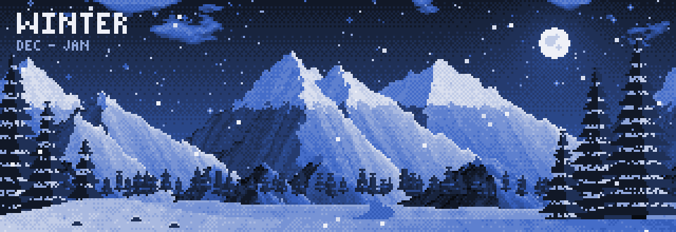
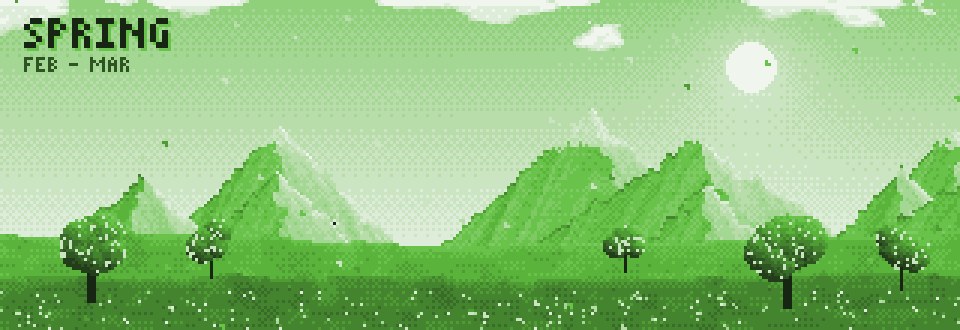
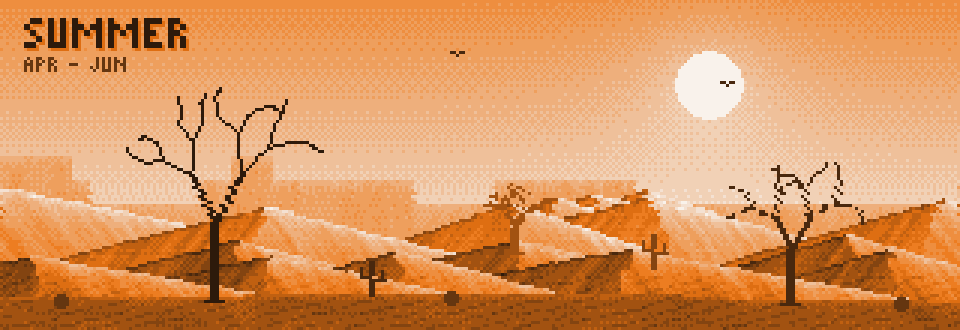
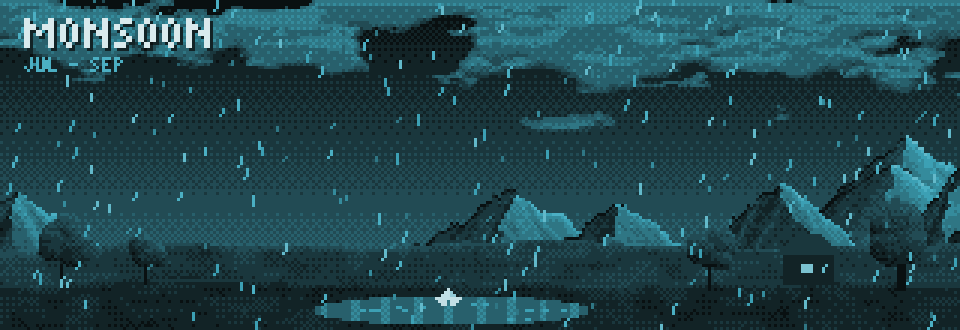
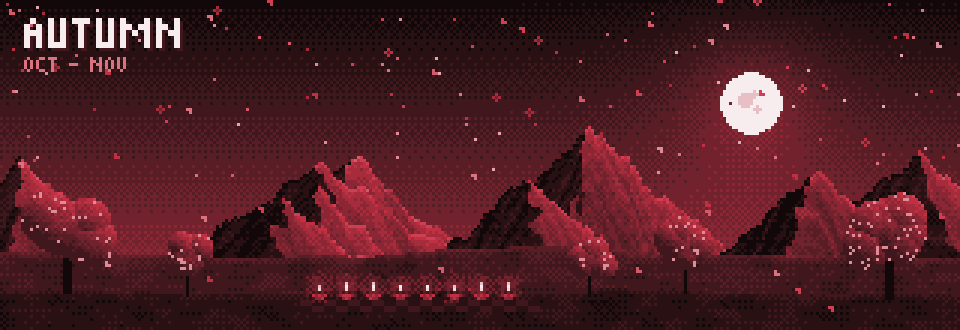

  

## Hello there, I am Prince Mehra

Full-stack developer working across AI, Cloud and DevOps. I build AI tools that save people real time: an assistant that runs your whole Google Workspace from chat (LangGraph, FastAPI), a document assistant that answers from your files and edits Word, Excel and PowerPoint for you (RAG, Next.js), and a PDF cleaner that cuts AI token costs. B.Tech at SGSITS Indore, Google Cloud AI certified, and open to AI Engineer, Full-Stack, Cloud and Forward Deployed roles.

## Connect with me

  
  
  
  
  

## Seasons where I code

<!-- SEASON:START -->

  
  
  
  
  
  
  
  

<!-- SEASON:END -->
